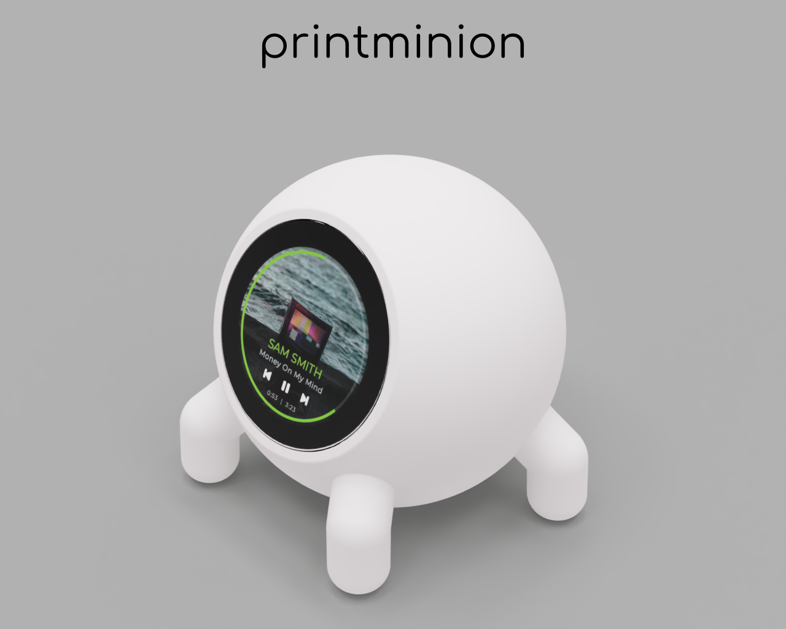

# Seeedstudio XIAO TFT_eSPI_GifPlayer With Touch control
Code for Seeed Studio 1.28 Round Display and Seeed Studio XIAO ESP32S3
Is a fork of [TFT_eSPI_GifPlayer](https://github.com/Seeed-Studio/Seeed_Arduino_RoundDisplay/tree/main/examples/TFT_eSPI_GifPlayer) example with added touch modifications

Components:
- [Seeed Studio 1.28 Round Display](https://www.seeedstudio.com/Seeed-Studio-Round-Display-for-XIAO-p-5638.html?queryID=928f4e218d4eaf5f2a77c841f268b17f&objectID=5638&indexName=bazaar_retailer_products) *(240x240 pixels)* and [Studio XIAO ESP32C3](https://www.seeedstudio.com/Seeed-XIAO-ESP32C3-p-5431.html) or [Studio XIAO ESP32S3](https://www.seeedstudio.com/XIAO-ESP32S3-p-5627.html).
- [Studio XIAO ESP32S3](https://www.seeedstudio.com/Seeed-XIAO-ESP32C3-p-5431.html) tiny MCU board with Wi-Fi and Bluetooth5.0, battery charge supported, power efficiency and rich Interface

Support me: [Buy Me A Coffee](https://www.buymeacoffee.com/printminion)

# 3d printed case
Enclosure for [Seeed Studio 1.28 Round Display](https://www.seeedstudio.com/Seeed-Studio-Round-Display-for-XIAO-p-5638.html?queryID=928f4e218d4eaf5f2a77c841f268b17f&objectID=5638&indexName=bazaar_retailer_products) *(240x240 pixels)* and [Studio XIAO ESP32C3](https://www.seeedstudio.com/Seeed-XIAO-ESP32C3-p-5431.html) or [Studio XIAO ESP32S3](https://www.seeedstudio.com/XIAO-ESP32S3-p-5627.html).

[collection of cases for this screen](https://cults3d.com/en/design-collections/printminion/seeed-studio-round-display-for-xiao-1-28-inch-round-touch-screen-240x240)

Check out videos:
- [Overview](https://www.youtube.com/watch?v=ahHhqOX7bnU&list=PLFmnthuksGmygz3sO5g7YNrulodxvZLMR&index=1)
- [Disassembly](https://www.youtube.com/watch?v=CCpf--G0LIk&list=PLFmnthuksGmygz3sO5g7YNrulodxvZLMR&index=2)
- [Assembly](https://www.youtube.com/watch?v=qn8rkIOUXXI&list=PLFmnthuksGmygz3sO5g7YNrulodxvZLMR&index=3)

* print case by yourself [cults3d](https://cults3d.com/en/design-collections/printminion/various-cases-for-waveshare-1-28inch-lcd-display-and-studio-xiao-esp32c3)
* get case on [shapeways](https://www.shapeways.com/shops/printminion)
* follow me on Twitter [@printminion](https://twitter.com/printminion)

Components:
- [Seeed Studio Round Display for XIAO - 1.28-inch round touch screen, 240×240 resolution, 65k colors, RTC, charge IC, TF card slot, JST 1.25 connector, All XIAO Compatible, HMI](https://www.seeedstudio.com/Seeed-Studio-Round-Display-for-XIAO-p-5638.html?queryID=928f4e218d4eaf5f2a77c841f268b17f&objectID=5638&indexName=bazaar_retailer_products)
- [Studio XIAO ESP32C3](https://www.seeedstudio.com/Seeed-XIAO-ESP32C3-p-5431.html) tiny MCU board with Wi-Fi and Bluetooth5.0, battery charge supported, power efficiency and rich Interface
- [Screws](https://amzn.to/3CkXUDs)
- [USB-C Adapter Cable (CMUP-CF, 10CM)](https://de.aliexpress.com/item/1005005416767887.html)
- For Battery assembly
    - [Battery LP852040](https://amzn.to/3J7gliF)
    - [Switch SS12D00 3pin](https://amzn.to/43yqVYp)
    - [Connector MX1,25 male 2P](https://amzn.to/43zPvb9)
    - [Connector for battery PG 2.0 female 2P](https://amzn.to/3N3io8B)
